

  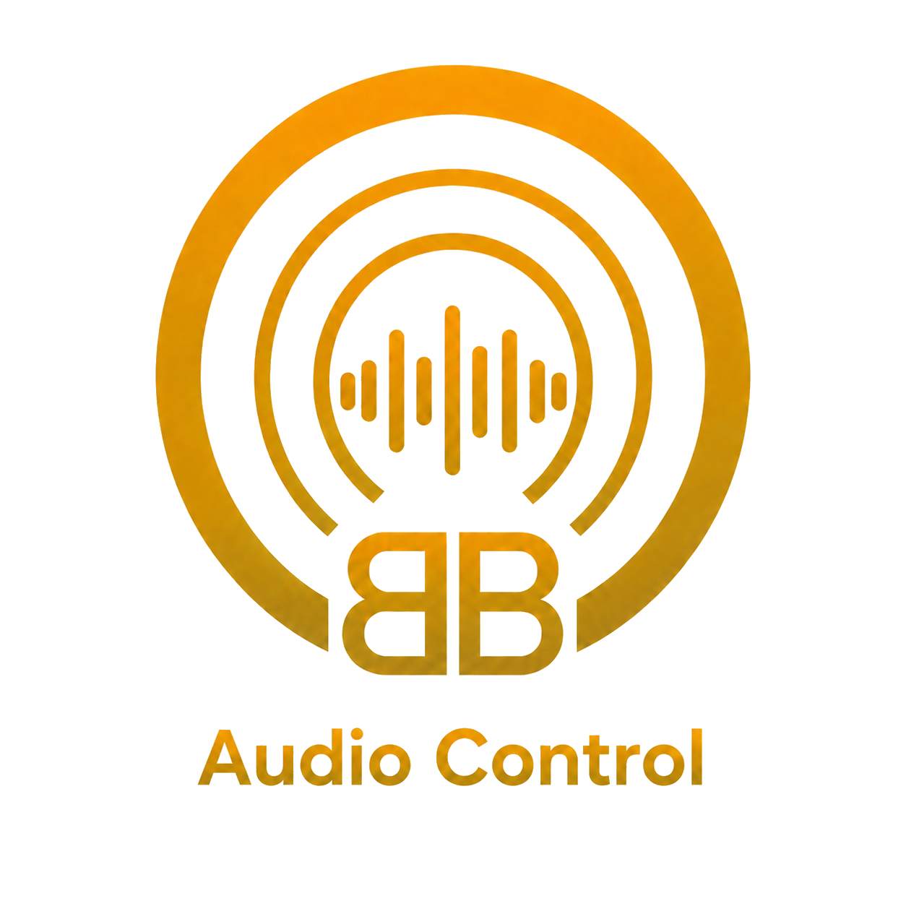

<h1 align="center">BB Audio Control</h1>

  <strong>Dein Windows-Audiomischpult auf Tablet und Smartphone.</strong> 
  Steuere Lautstärke, Audioausgänge, Mikrofon und Medien direkt über dein lokales Netzwerk.

  
  
  

  <a href="https://github.com/macson17/BB-Audio-Control/releases/tag/v1.2.0"><strong>BB Audio Control 1.2.0 herunterladen</strong></a>
  · <a href="#installation">Installation</a>
  · <a href="CHANGELOG-DE.md">Änderungen</a>
  · <a href="README.md">English</a>

  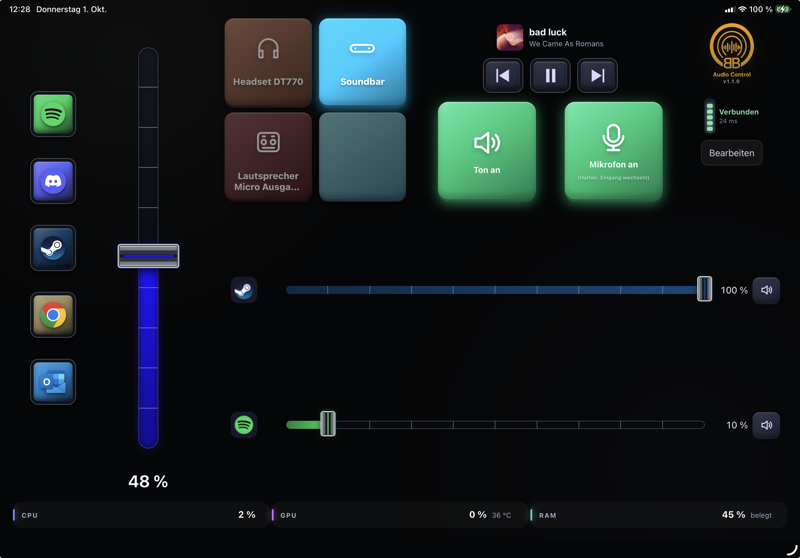

## Neu in 1.2.0: GitHub-Updates

Die Windows-App sucht beim Start und täglich nach neueren stabilen GitHub-Versionen. "Nach Updates suchen" ist in den Einstellungen und im Traymenü verfügbar. "Jetzt installieren" lädt den Installer herunter, prüft dessen SHA-256 und startet das Update. "Später" verschiebt den Hinweis um einen Tag. PIN, Einstellungen, Programmbelegungen und die Autostartwahl bleiben erhalten. Der Installer ist derzeit nicht digital signiert. Der Updateabruf benötigt Internet und verbindet sich mit GitHub; Audio- und Programmeinstellungen werden nicht hochgeladen.

## Neu in 1.1.0

- Fünf Programmstarter auf dem Tablet mit echten Windows-Icons, eigener Farbe und optionalem Namen. Kurz drücken startet die App oder holt ein vorhandenes Fenster nach vorn.
- Drei Sekunden halten beendet die zugeordnete App zwangsweise, auch im Hintergrund. Ungespeicherte Arbeit kann verloren gehen. Windows kann die Fokusübernahme einschränken; Skripte, Installer und Protokollverknüpfungen sind nicht immer eindeutig zuzuordnen.
- In der Windows-App: Programmstarter ausklappen, Apps aus dem Startmenü suchen oder eine Datei auswählen und Namen sowie Farben anpassen.
- Ab 1107 × 710 CSS-Pixeln erscheint die Tabletansicht. Kleinere Browserflächen nutzen die Smartphoneansicht ohne Programmstarter. Die Programmlautstärkefader bleiben sichtbar.
- Prozentanzeige unter dem Hauptfader, überarbeitete Medientasten, dimmbare Hintergründe und modernisierte Windows-Einstellungen.
- Programmbelegungen, Einstellungen und Kopplungs-PIN bleiben beim Update erhalten.

### Windows-App 1.1.0

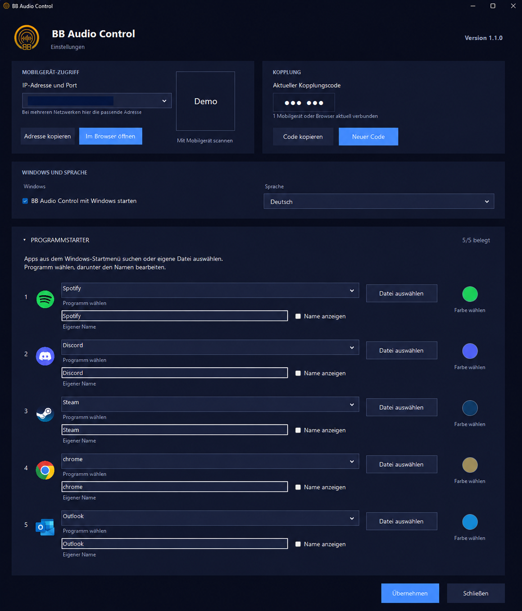

*Verbindungsdaten im Windows-Bild sind für die Veröffentlichung anonymisiert.*

## Ein responsives Mischpult für deinen Windows-PC

BB Audio Control macht iPads, Android-Tablets und Smartphones zu einer direkten
Fernbedienung für den Ton eines Windows-PCs. Ein Cloudkonto ist nicht nötig:
PC und Mobilgerät kommunizieren unmittelbar im lokalen Netzwerk.

| Pro App steuern | Audio frei verteilen | Aktive Medien bedienen |
|---|---|---|
| Lautstärke und Mute für bis zu fünf aktive Programme | Standardausgang wechseln oder einer einzelnen App einen eigenen Ausgang geben | Titel, Interpret und Cover sehen sowie Spotify, YouTube und andere aktive Medien steuern |

## In drei Schritten startklar

1. Den aktuellen Windows-Installer aus dem [Release 1.2.0](https://github.com/macson17/BB-Audio-Control/releases/tag/v1.2.0) herunterladen und installieren.
2. BB Audio Control öffnen und den QR-Code mit dem Tablet oder Smartphone scannen.
3. Die angezeigte sechsstellige PIN eingeben und die Oberfläche auf Wunsch zum Startbildschirm hinzufügen.

> [!NOTE]
> PC und Mobilgerät müssen sich im selben erreichbaren Netzwerk befinden. Die
> Verbindung bleibt lokal; BB Audio Control benötigt keinen externen Cloud-Dienst.

> [!WARNING]
> Der Installer ist noch nicht digital signiert. Windows SmartScreen kann
> „Unbekannter Herausgeber“ anzeigen. Nur Dateien aus diesem Repository verwenden.

## Weitere Ansichten (1.0.0)

<table>
  <tr>
    <td width="50%">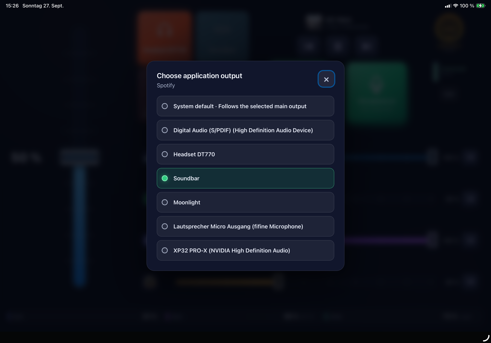</td>
    <td width="50%">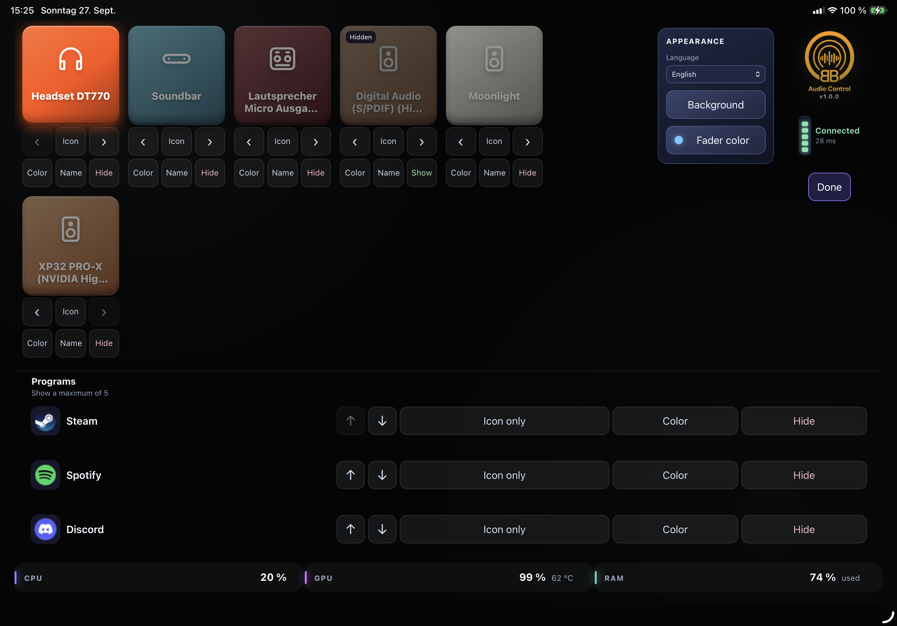</td>
  </tr>
  <tr>
    <td align="center"><strong>Audioausgang pro Anwendung</strong> Eine App kann dem Systemstandard oder gezielt einem anderen Gerät folgen.</td>
    <td align="center"><strong>Frei anpassbare Oberfläche</strong> Ausgänge und Programme sortieren, benennen, gestalten oder ausblenden.</td>
  </tr>
  <tr>
    <td width="50%">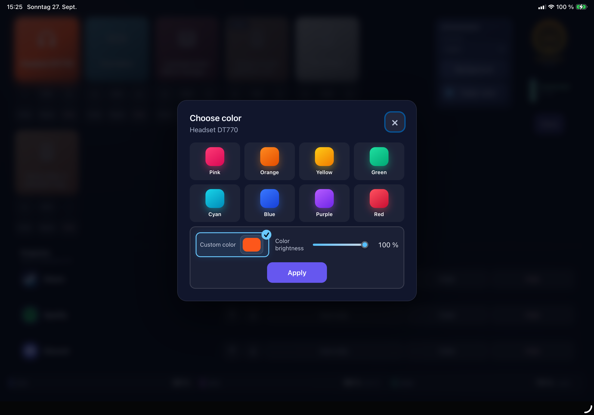</td>
    <td width="50%">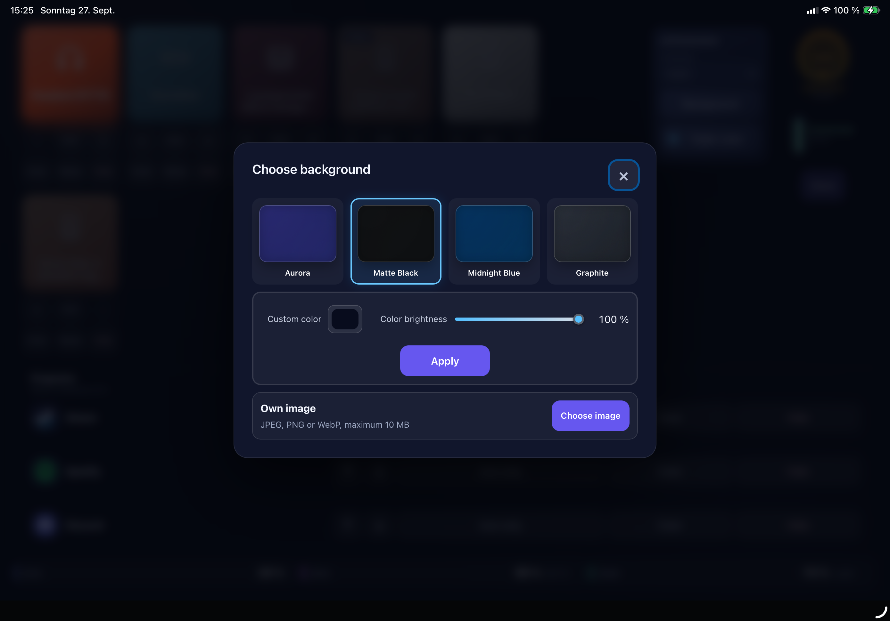</td>
  </tr>
  <tr>
    <td align="center"><strong>Farben und Leuchtkraft</strong> Vorschläge nutzen oder eigene Farben samt Helligkeit einstellen.</td>
    <td align="center"><strong>Eigener Hintergrund</strong> Vorschlag, freie Farbe oder Bild auf allen gekoppelten Geräten verwenden.</td>
  </tr>
</table>

Smartphone und frühere Ansichten

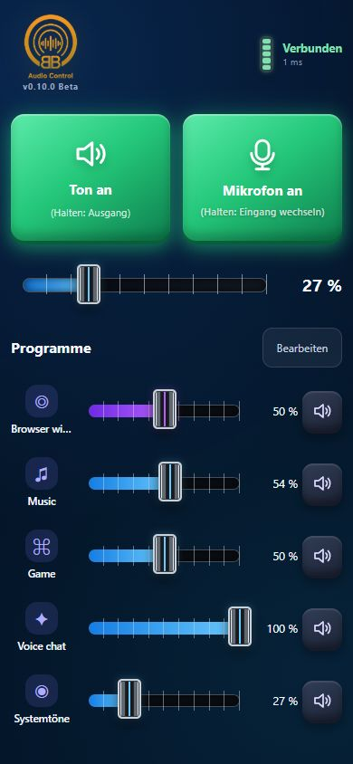
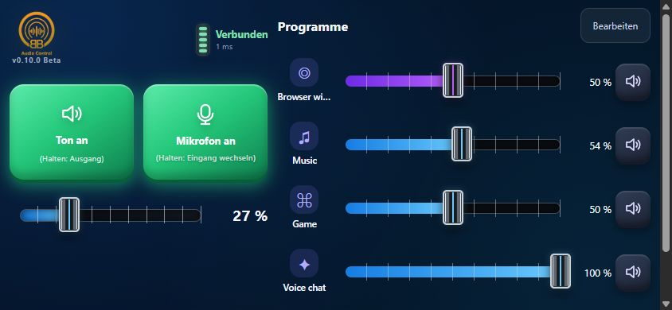
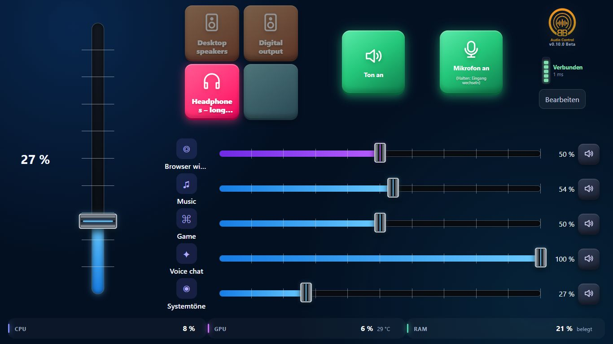
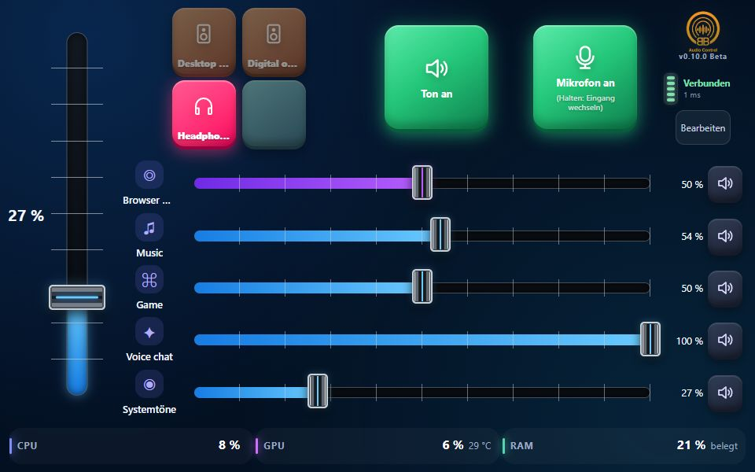

## Funktionen

- Master-Lautstärke und Master-Mute über alle aktiven Ausgänge mit Wiederherstellung der vorherigen Mute-Zustände
- Lautstärke und Mute je aktivem Programm und Audioausgang
- Wechsel des Windows-Standardausgangs
- Optionaler Audioausgang pro App durch Antippen des App-Icons; Systemstandard folgt weiterhin den Hauptausgangstasten
- Mediensteuerung der aktiven Windows-Mediensitzung mit Cover, Titel, Interpret,
  Vor, Zurück und unmittelbar reagierendem statusabhängigem Play/Pause; damit
  lässt sich auch YouTube im Browser pausieren
- Mikrofon stumm- und einschalten
- Mikrofoneingang durch langen Druck auf die Mikrofon-Taste wechseln
- Bis zu fünf frei sortier- und ausblendbare Programme
- Global und pro Programm wählbare Faderfarben mit freier Farbe und Leuchtkraft
- Anpassbare Ausgangsnamen, Symbole und Farben
- Vier Hintergrundvorschläge, freie Hintergrundfarbe mit Leuchtkraft und ein
  zentral gespeichertes eigenes Hintergrundbild für gekoppelte Geräte
- Deutsch und Englisch
- PIN-Kopplung und lokaler QR-Code
- CPU-, GPU- und RAM-Anzeige auf Tablets, soweit vom System unterstützt
- Direkte Bedienreaktion über WebSocket im lokalen Netzwerk
- Auswahl aller aktiven lokalen IPv4-Adressen im Windows-Fenster; QR-Code, Kopieren und Browseröffnung folgen der Auswahl

## Voraussetzungen

- Windows 10 ab Build 19041 oder Windows 11
- 64-Bit-Windows auf einem x64-kompatiblen System
- Tablet oder Smartphone mit einem aktuellen Webbrowser
- PC und Tablet im selben erreichbaren privaten Netzwerk

Auf dem Ziel-PC muss keine separate .NET-Laufzeit installiert werden.

## Installation

1. `BB-Audio-Control-Setup-v1.2.0.exe` aus dem
   [Release 1.2.0](https://github.com/macson17/BB-Audio-Control/releases/tag/v1.2.0) laden.
2. Die Setup-Datei starten und Deutsch oder Englisch auswählen.
3. Bei einer SmartScreen-Warnung „Weitere Informationen“ und anschließend
   „Trotzdem ausführen“ wählen, wenn die Datei aus diesem Repository stammt.
4. Den standardmäßig aktivierten Autostart bei Bedarf abwählen.
5. Die Windows-Abfrage für die private Firewall-Regel bestätigen.
6. Im Einstellungsfenster den QR-Code scannen oder die angezeigte lokale
   Adresse auf dem Tablet öffnen.
7. Den sechsstelligen Pairing-Code eingeben.

Weitere Einzelheiten stehen in der
[deutschen Installationsanleitung](README-Installation-DE.md). Die
[englische Installationsanleitung](README-Installation.md) ist ebenfalls
verfügbar.

## Update

Eine neuere Setup-Datei wird einfach über die vorhandene Version installiert.
Einstellungen und Pairing-Code bleiben erhalten. Eine normale Deinstallation
lässt diese persönlichen Einstellungen ebenfalls bestehen.

## Sicherheit und Datenschutz

BB Audio Control verwendet keinen Cloud-Dienst. Die Kommunikation bleibt im
lokalen Netzwerk und erfordert für die Steuerung einen sechsstelligen
Pairing-Code. Ein neuer Code trennt bestehende Verbindungen und macht den alten
Code sofort ungültig.

Die Übertragung erfolgt derzeit über HTTP und WebSocket und ist nicht
transportverschlüsselt. Pairing-Code und Steuerbefehle könnten in einem
kompromittierten lokalen Netzwerk mitgelesen werden. Die Anwendung sollte nur
in einem vertrauenswürdigen privaten Netzwerk verwendet werden.

Weitere Hinweise stehen in [SECURITY-DE.md](SECURITY-DE.md).

## Bekannte Einschränkungen

Die Darstellung wurde nach Nutzerprüfung auf **iPad, TABWEE T80, iPhone 16 Pro
und Samsung Galaxy S21 Ultra erfolgreich geprüft**. Das bestätigt die
Darstellung, nicht sämtliche Audio-, Hardware- oder PWA-Funktionen.

Auf Tablets erscheinen Titel und Interpret sowie die Mediensteuerung der aktiven
Windows-Mediensitzung. Ein Tipp auf das App-Icon öffnet die optionale
Audioausgangswahl. Auf Smartphones bleibt die komplette Musiksektion verborgen.

- Snapdragon-/ARM-Systeme sind noch nicht abschließend getestet.
- GPU-Auslastung und GPU-Temperatur hängen von Windows und dem Grafiktreiber ab.
- `– °C` bedeutet, dass kein unterstützter Temperaturwert bereitgestellt wird.
- Smartphones zeigen keine Ausgangskacheln und keine CPU-, GPU- oder RAM-Werte.
- Auf Smartphones öffnet langes Drücken auf „Sound“ die Ausgangswahl; kurzes
  Drücken schaltet den Ton stumm oder wieder ein.
- Die normale Tablet-Ansicht scrollt nicht; Bearbeiten-Modus und sehr kurze Smartphone-Viewports dürfen bei Bedarf scrollen.
- Version 1.1.0 verwendet die direkte Windows-D3DKMT-Adapterenumeration für
  GPU-Temperaturen; der Anwendungspfad wurde auf einer AMD Radeon 780M
  praktisch bestätigt.
- Es werden maximal fünf Programme gleichzeitig angezeigt.
- Programme erscheinen erst, wenn Windows eine aktive Audio-Session meldet.
- Gastnetz-Isolation, VPN oder Firewall können die Tablet-Verbindung blockieren.
- Die lokale PC-Adresse kann sich nach einem Netzwerkwechsel ändern.
- Der Installer ist noch nicht digital signiert.
- Seit 1.2.0 werden GitHub-Updates automatisch gesucht; die Installation erfolgt erst nach Zustimmung.

Weitere Änderungen sind im [Änderungsprotokoll](CHANGELOG-DE.md) aufgeführt.

## Probleme und Wünsche

Für nachvollziehbare Fehlerberichte und Funktionswünsche können die
[GitHub Issues](https://github.com/macson17/BB-Audio-Control/issues) verwendet
werden. Bitte niemals Pairing-Codes, echte lokale IP-Adressen, Rechnernamen,
Benutzerpfade oder andere persönliche Daten veröffentlichen.

## Quellcode und Drittanbieterkomponenten

Dieses öffentliche Repository ist ausschließlich für Produktinformationen,
Support und Binär-Downloads bestimmt. Der eigene Quellcode von BB Audio Control
ist proprietär und wird nicht öffentlich bereitgestellt. Dieses Repository ist
kein Open-Source-Projekt und enthält bewusst keine Open-Source-Lizenz für den
eigenen Programmcode.

Der Installer enthält die erforderlichen Lizenz- und Copyright-Hinweise für
die verwendeten Drittanbieterkomponenten, darunter NAudio, QRCoder und die
eingebettete .NET-Laufzeit.
