# BB Audio Control

Current test version: **0.11.2 Beta** (pre-release).

[English](README.md) | [Deutsch](README-DE.md)

BB Audio Control turns tablets and smartphones on your local network into a
clean audio mixer for a Windows PC. Control volume, mute states, audio outputs,
and the microphone without leaving your current game or application.

> **Beta:** BB Audio Control is still being tested. The current installer is
> not digitally signed, so Windows SmartScreen may display an "Unknown
> publisher" warning.

## Download

The latest test version is available as a single setup file on the
[0.11.2 Beta pre-release](https://github.com/macson17/BB-Audio-Control/releases/tag/v0.11.2)
page. Only download files from this official repository.

## Screenshots

### Tablet interface — 0.11.0 Beta

The current gallery starts with the approved tablet interface.

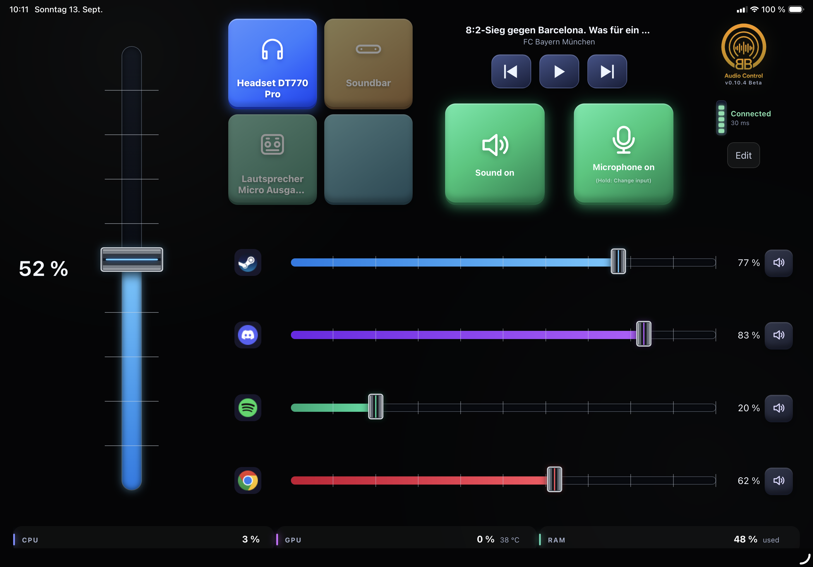
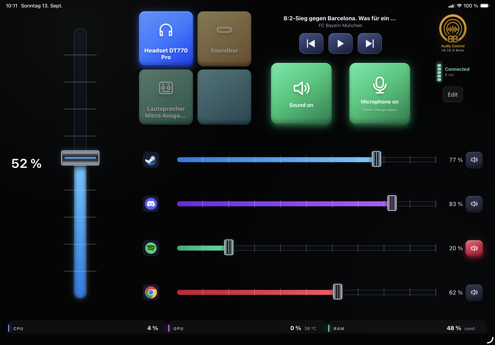
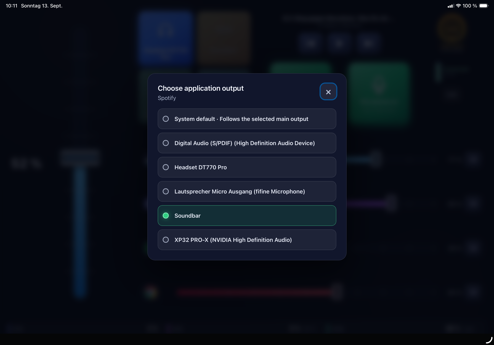
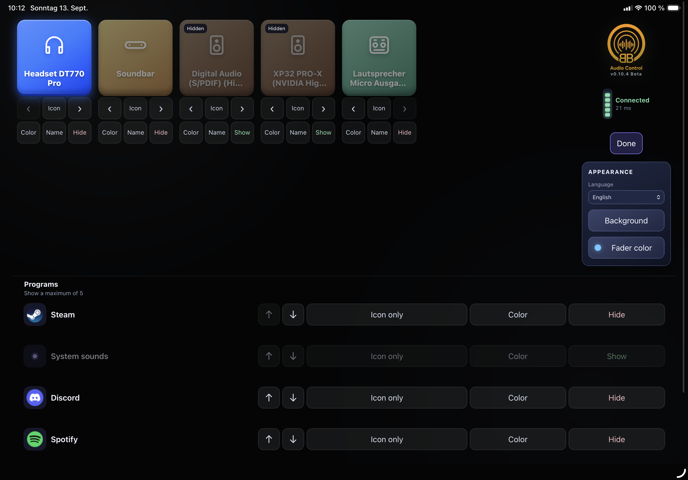

### Smartphone

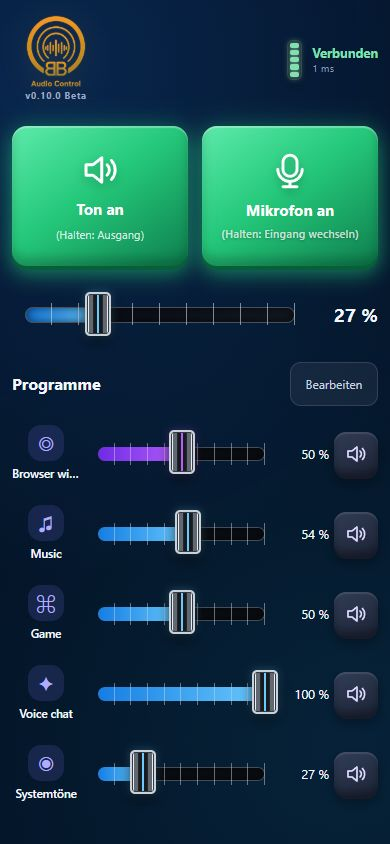
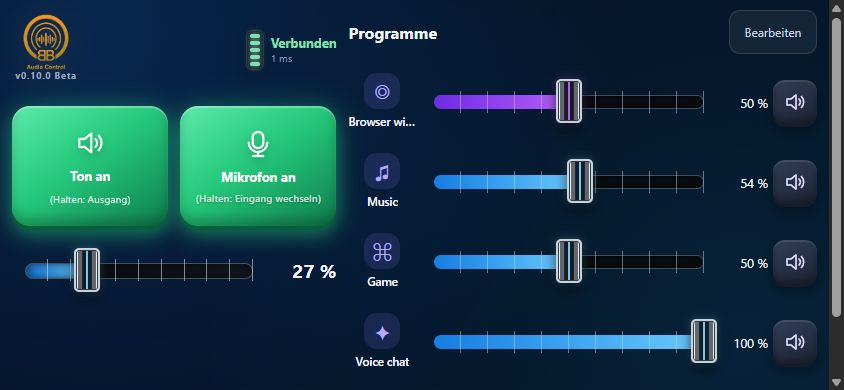

Earlier interface views

### Earlier tablet views

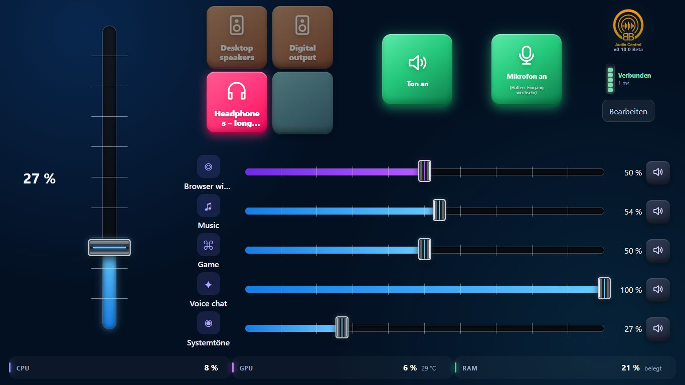
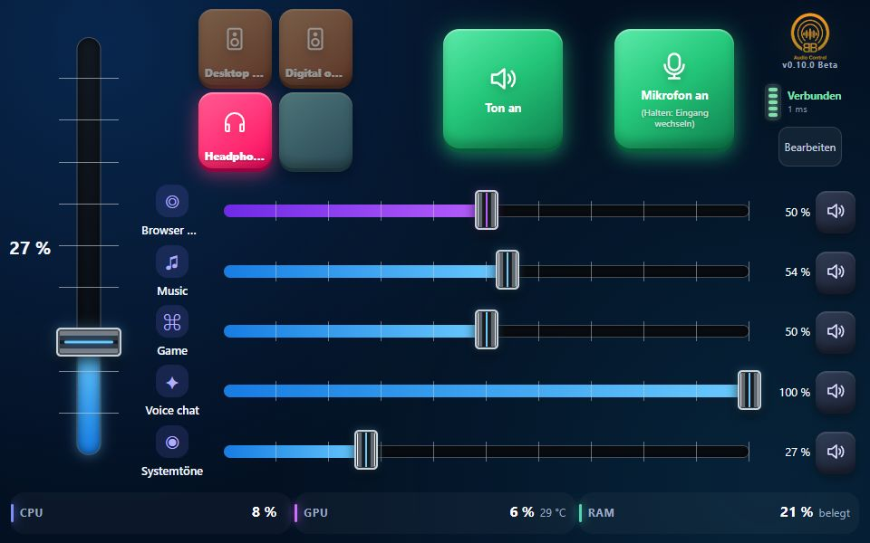
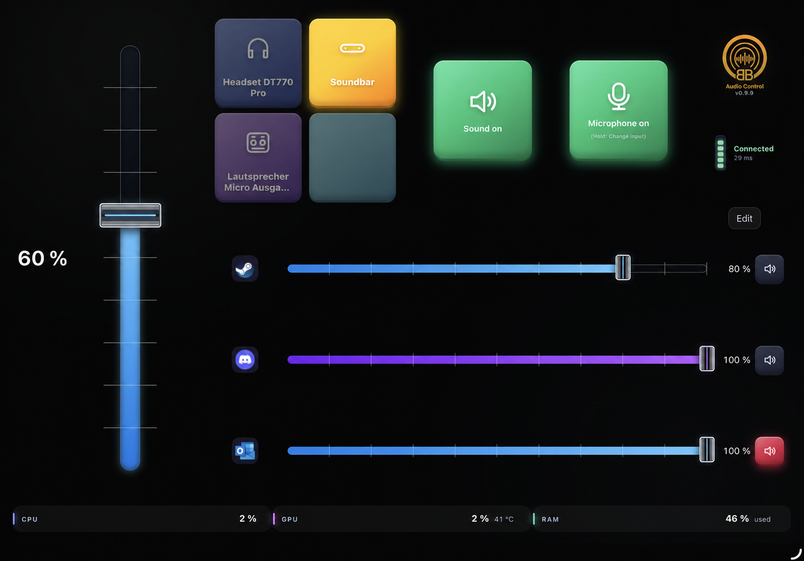
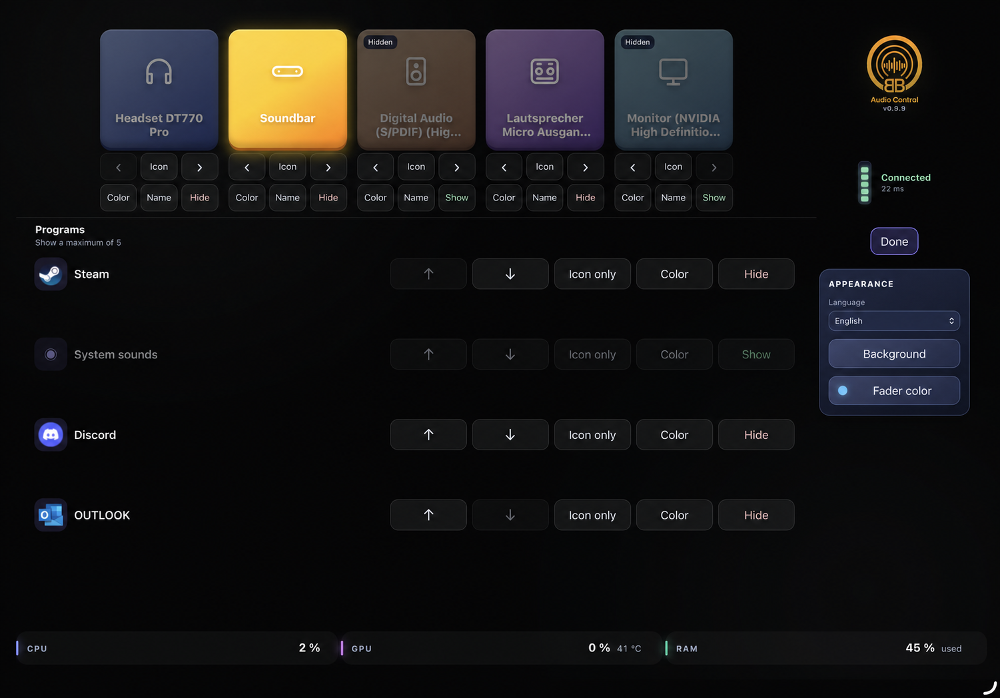

### Background selection

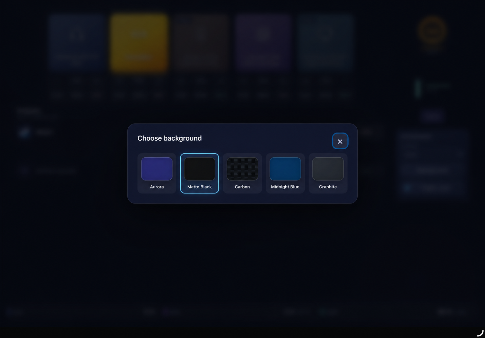

### Fader color selection

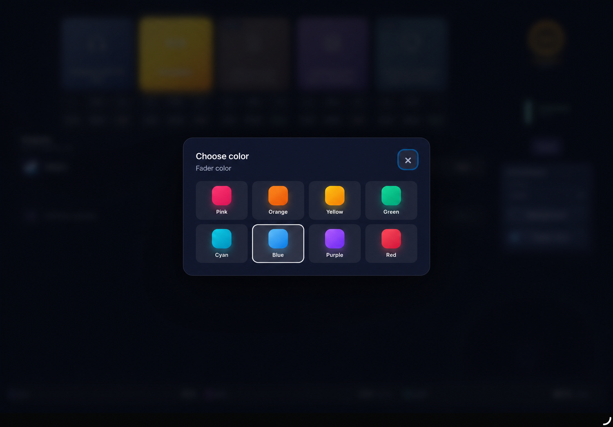

## Features

- Master volume and master mute across active outputs, restoring their previous mute states
- Per-application volume and mute for each audio output
- Switch the Windows default audio output
- Select an optional output for an application by tapping its app icon; System default continues to follow the main output buttons
- Control the active Windows media session with previous, next, and state-aware play/pause controls; this can also pause YouTube in a browser
- Mute and unmute the microphone
- Change the microphone input by holding the microphone button
- Show, hide, and reorder up to five applications
- Global and per-application fader colors
- Custom output names, icons, and colors
- Five background themes
- German and English interface
- PIN pairing and a locally generated QR code
- CPU, GPU, and RAM information on tablets where supported by the system
- Responsive controls over WebSocket on the local network
- Select any active local IPv4 address in the Windows settings window; QR code, copy, and browser actions follow the selection

## Requirements

- Windows 10 build 19041 or later, or Windows 11
- 64-bit Windows on an x64-compatible system
- Tablet or smartphone with a current web browser
- PC and tablet on the same reachable private network

No separate .NET runtime installation is required on the target PC.

## Installation

1. Download `BB-Audio-Control-Setup-v0.11.2.exe` from the pre-release.
2. Start the setup file and select German or English.
3. If SmartScreen displays a warning, select "More info" and then "Run
   anyway" only if the file came from this repository.
4. Disable the preselected startup option if you do not want the app to start
   with Windows.
5. Confirm the Windows prompt for the private-network firewall rule.
6. In the PC settings window, scan the QR code or open the displayed local
   address on the tablet.
7. Enter the six-digit pairing code.

See the [English installation guide](README-Installation.md) or the
[German installation guide](README-Installation-DE.md) for more details.

## Updates

Run a newer setup file over the existing installation. Settings and the
pairing code are retained. A normal uninstall also keeps these personal
settings for a later reinstall.

## Security and privacy

BB Audio Control does not use a cloud service. Communication stays on the
local network, and control access requires a six-digit pairing code. Creating
a new code disconnects existing clients and immediately invalidates the old
code.

Communication currently uses HTTP and WebSocket without transport encryption.
The pairing code and control commands could be observed on a compromised local
network. Only use the application on a trusted private network.

See [SECURITY.md](SECURITY.md) for details.

## Known limitations

User-reported display checks passed on **iPad, iPhone 16 Pro, and Samsung
Galaxy S21 Ultra**. The **TABWEE T80 beta test is still pending**. These are
display checks, not a claim that every audio, hardware, or PWA scenario was tested.

On tablets, title and artist information plus media controls are shown for the
active Windows media session. Tap an application's icon to choose its optional
audio output. The complete media section remains hidden on phones.

- Snapdragon/ARM systems have not yet been fully tested.
- GPU usage and temperature depend on Windows and the graphics driver.
- `– °C` means that no supported temperature value is available.
- Phones do not display output tiles or CPU, GPU, and RAM information.
- On phones, holding Sound opens the output selection; tapping it mutes or
  unmutes the sound.
- The normal tablet view does not scroll; Edit mode and very short phone viewports may scroll when necessary.
- Version 0.11.2 uses direct Windows D3DKMT adapter enumeration for GPU temperatures; practical verification in the application on the diagnosed AMD Radeon 780M is still pending.
- A maximum of five applications can be displayed at the same time.
- Applications appear only after Windows reports an active audio session.
- Guest-network isolation, VPN software, or a firewall may block the tablet
  connection.
- The local PC address may change after switching networks.
- The installer is not digitally signed yet.
- Automatic updates are not available yet.

See the [changelog](CHANGELOG.md) for further changes.

## Issues and feature requests

Use [GitHub Issues](https://github.com/macson17/BB-Audio-Control/issues) for
reproducible bug reports and feature requests. Never publish pairing codes,
real local IP addresses, computer names, user paths, or other personal data.

## Source code and third-party components

This public repository is intended only for product information, support, and
binary downloads. The BB Audio Control source code is proprietary and is not
published. This is not an open-source project, and this repository deliberately
does not provide an open-source license for the application's own code.

The installer includes the required license and copyright notices for its
third-party components, including NAudio, QRCoder, and the bundled .NET runtime.
